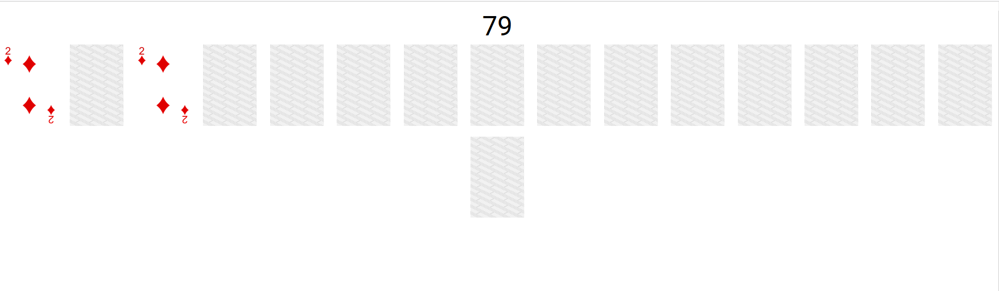
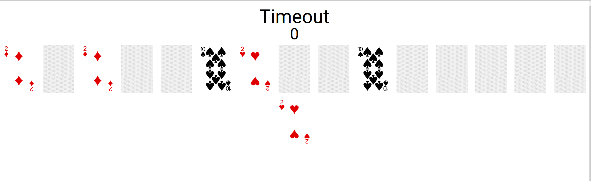

# Readme

This is a memory card match game

## Requirements
* Node (14+)
* Angular (13+)

## Run
Checkout code
```angular2html
$> git clone https://github.com/tmjeee/card-match-game.git
$> cd card-match-game/workspace
```

Start application
```angular2html
$> npx ng serve --configuration=development
```
open web browser and access
```angular2html
http://localhost:4200/card-match
```

## Screenshots



